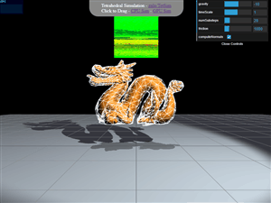

# [TetSim](https://zalo.github.io/TetSim/)

<p align="left">
  <a href="https://github.com/zalo/TetSim/deployments/activity_log?environment=github-pages">
      </a>
  <a href="https://github.com/zalo/TetSim/commits/master">
      </a>
  <!--<a href="https://github.com/zalo/TetSim/blob/master/LICENSE">
      </a>-->  <!-- No idea what license this should be! -->
</p>

Simulate Tetrahedral FEM Models in your browser in real-time using the GPU!



This repo contains two proof-of-concept demos:

## [CPU Sim](https://zalo.github.io/TetSim/?cpu=true)

This one is a plain rehosting of [Miles Macklin and Matthias Müller's A Constraint-based Formulation of Stable Neo-Hookean Materials](http://blog.mmacklin.com/publications/#:~:text=A%20Constraint-based%20Formulation%20of%20Stable%20Neo-Hookean%20Materials) demo.  
I've broken the script into several ES6 Module pieces with the intention of improving reusability.

## [GPU Sim](https://zalo.github.io/TetSim?cpu=false)

This one rewrites the entire simulation as a set of GPU passes on Render Textures (gaining a **~20x speedup**).  This does NOT use the Neohookean energy/constraint function.  This is because the Neohookean function only converges well with Gauss-Seidel iterations (which are tricky to implement on the GPU (see: [Graph Coloring](https://erkaman.github.io/posts/gauss_seidel_graph_coloring.html)), and especially tricky to implement for this example dragon mesh, which has vertices with over 30 connecting tetrahedra).   Instead, this simulation uses [Matthias Müller's Robust Polar Decomposition](https://www.youtube.com/watch?v=YOBjHpoImu8) on the tetrahedra, which converges much faster (and with GPU-friendly Jacobi Iterations).

 - 20x faster
 - Even works on Mobile Devices (though Android devices behave strangely)
 - Not physically correct (doesn't incorporate deltaTime properly yet)


 # Building

This demo can either be run without building (in Chrome/Edge/Opera since raw three.js examples need [Import Maps](https://caniuse.com/import-maps)), or built with:
```
npm install
npm run build
```
After building, make sure to edit the index .html to point from `"./src/main.js"` to `"./build/main.js"`.

 # Dependencies
 - [three.js](https://github.com/mrdoob/three.js/) (3D Rendering Engine)
 - [esbuild](https://github.com/evanw/esbuild/) (Bundler)
